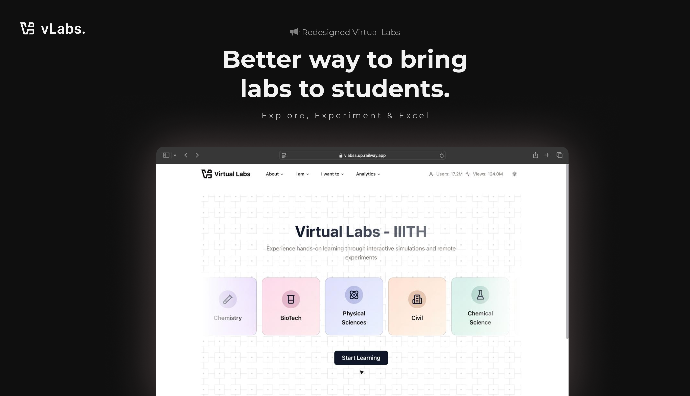

# 🚀 Virtual Labs  
> [!IMPORTANT]  
> This project is a **redesign submission for a hackathon** and is **not affiliated with or endorsed by [VLEAD]**. It is for **educational and non-commercial purposes only**.
> 
> We are **NOT** liable for any issues, damages, or malfunctions that may arise from self-hosting this project. Proceed at your own risk.

---

## **Why Choose This Version of vLabs?**  

✅ **Interactive Experiments** – Fully immersive lab simulations.  
✅ **Pre and Post Tests** – Evaluate your understanding before and after experiments.  
✅ **Real-time Simulations** – Experience realistic physics and chemistry concepts.  
✅ **Dark/Light Theme Support** – Choose your preferred mode.  
✅ **Responsive Design** – Seamlessly accessible on all devices.  

---

## **Our Vision**  
We built vLabs with a commitment to:  
- **Speed** – Optimized performance for smooth user experience.  
- **Ease of Use** – Simple and intuitive interface.  
- **Aesthetics** – A visually appealing design that enhances learning.  

---

## **Contributors**  

  

<table>
  <tbody>
    <tr>
      <td align="center" width="14.28%"><a href="http://suhas-resume.vercel.app"> <b>Suhas</b></a> 
        💻 🎨 🐛  🚧 📆 🛡️ 🔧
      </td>
      <td align="center" width="14.28%"><a href="https://github.com/tCharan369"> <b>Charan</b></a> 
        💻 🐛 🚧 👀🔧
      </td>
      <td align="center" width="14.28%"><a href="https://github.com/heyyesh"> <b>Yeshwanth</b></a> 
        🐛💻
      </td>
      <td align="center" width="14.28%"><a href="https://github.com/RajVamshi05"> <b>Raj Vamshi</b></a> 
        💻 🐛👀
      </td>
      <td align="center" width="14.28%"><a href="https://github.com/Nikhilhero13"> <b>Nikhil</b></a> 
        🔣👀
      </td>
    </tr>
  </tbody>
</table>

---

## 📜 License  

This project is licensed under [MIT-LICENSE](https://opensource.org/license/mit).  

### ✅ **You are free to:**  
- **Share** – Copy and redistribute the material in any medium or format.  

### ⚠️ **Under the following terms:**  
- **Attribution** – You must give proper credit and indicate changes made.  
- **NonCommercial** – You may **not** use this for commercial purposes.

---

💡 **Contributions, issues, and feature requests are welcome!**  
⭐ If you like this project, consider giving it a star!  

---
